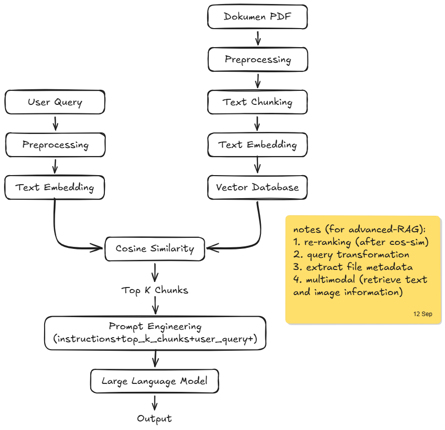

# **RetoriQA 📚🤖**

🚧 **Status:** Active Development (System Design & Experimentation Phase)

**RetoriQA** is an intelligent Question-Answering (QA) system powered by Large Language Models (LLMs) and the Retrieval-Augmented Generation (RAG) framework. It is designed to "read" PDF documents and provide accurate, context-aware answers to user queries based entirely on the provided text.

## **🛑 The Problem**

Professionals, researchers, and students often deal with lengthy, dense PDF documents (e.g., research papers, technical manuals, corporate reports).

* Traditional keyword searches (Ctrl+F) are inefficient as they lack semantic understanding.  
* Manually skimming through hundreds of pages to find a specific piece of information is time-consuming.  
* Existing public LLMs cannot answer questions about private, proprietary, or recently published documents without suffering from "hallucinations."

## **🎯 Project Objectives**

RetoriQA aims to bridge the gap between static documents and interactive information retrieval. The main objectives are:

1. **Accurate Retrieval:** Implement a robust semantic search pipeline to find the most relevant chunks of text from a PDF.  
2. **Contextual Generation:** Use an LLM to synthesize the retrieved chunks into a natural, easy-to-understand answer.  
3. **Traceability:** Ensure the system can cite the specific page or section of the PDF where it found the information.  
4. **Experimentation:** Test and benchmark various chunking strategies, embedding models, and vector databases to find the most efficient workflow.

## **⚙️ System Architecture & Design**

The system relies on a standard RAG pipeline, divided into two main phases: **Document Ingestion** (Data Preparation) and **Query Execution** (Inference).

### **1\. Document Ingestion Phase**

* **Parsing:** The system extracts raw text from PDF files using OCR or PDF parsers.  
* **Chunking:** The extracted text is split into smaller, overlapping chunks to preserve contextual meaning.  
* **Embedding:** A pre-trained embedding model converts these text chunks into high-dimensional vector representations.  
* **Storage:** The vectors and their corresponding metadata (e.g., page numbers) are stored in a Vector Database.

### **2\. Query & Generation Phase**

* **Query Embedding:** The user's question is converted into a vector using the same embedding model.  
* **Retrieval:** The system performs a similarity search in the Vector Database to fetch the top K most relevant text chunks.  
* **Generation:** The retrieved chunks are combined with the user's question in a carefully crafted prompt. The LLM then reads this context and generates a precise answer.

## **🛠️ Planned Tech Stack**

As the project is currently in the experimental phase, the tech stack is subject to change. Current considerations include:

* **Programming Language:** Python  
* **Orchestration Framework:** LangChain / LlamaIndex  
* **Embedding Model:** Hugging Face sentence-transformers / OpenAI Embeddings  
* **Vector Database:** ChromaDB / FAISS / PostgreSQL with pgvector  
* **LLM:** Meta Llama 3 / OpenAI GPT-3.5 / Gemini  
* **Backend:** FastAPI (planned)

## **🗺️ Roadmap / Current Progress**

* \[x\] Define Problem Statement and Core Objectives.  
* \[x\] Design RAG System Architecture.  
* \[ \] **\[In Progress\]** Evaluate PDF parsing and text chunking strategies.  
* \[ \] Experiment with different open-source embedding models.  
* \[ \] Set up the local Vector Database.  
* \[ \] Develop the retrieval and generation pipeline.  
* \[ \] Build a simple API via FastAPI.  
* \[ \] (Future) Develop a simple web UI for uploading PDFs and chatting.

*Developed by Nico Arya Divano. This repository serves as a workspace for AI engineering and LLM application development.*